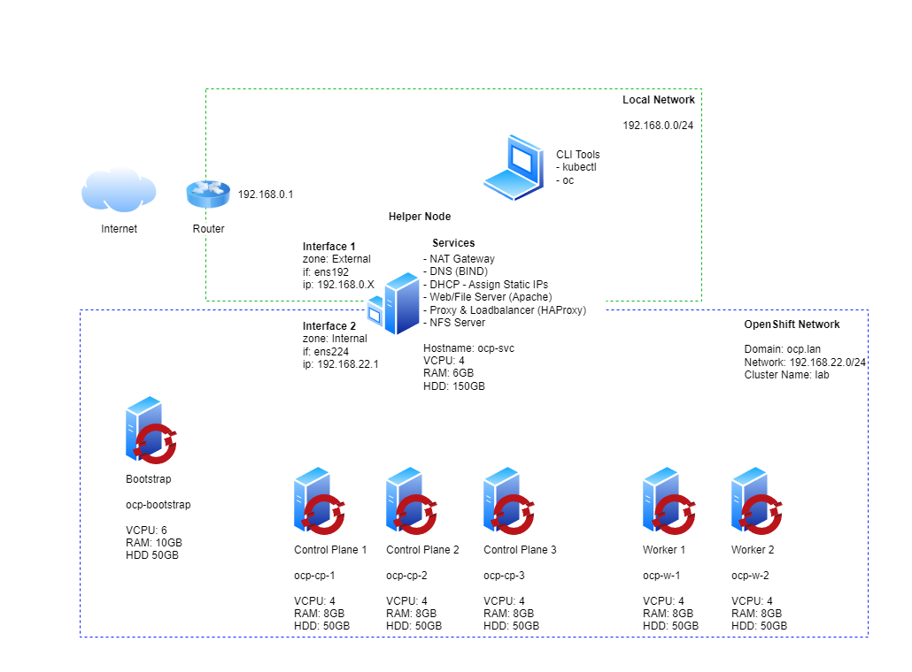

# OKD4 Bare Metal Install - User Provisioned Infrastructure (UPI)

## Objective

Maintain a Open Enterprise Container Orchestration Platform, OKD4.

Redo RyanHay's tutorial and update it to use latest and open technologies.

- Forked from https://github.com/ryanhay/ocp4-metal-install 
- New repo at https://github.com/kennykhooky/okd4-metal-install

Thank [ryanhay](https://github.com/ryanhay/) for the original RyanHay's video tutorial at https://www.youtube.com/watch?v=d03xg2PKOPg

New Youtube Video will be at https://www.youtube.com/watch?v=xxxxxxxxxxx

## Compare

| Tables   |      Before      |  Current |  Others |
|----------|:-------------:|:------:|------:|
| Hypervisor | VMware ESXi | Proxmox PVE |
| Enterprise<br/>Container Orchestration Platform<br/>(With Monitoring, Log and e.t.c.) |  OpenShift | OKD4 |
| Container Orchestration Platform |    Kubernetes   |   Kubernetes | Portainer
| Container Engine | Podman | Podman |
| Container Runtime | Docker | CRI-O | Contained
| Container OS | Redhat CoreOS | Fedora CoreOS | 

## Outline
- [OKD4 Bare Metal Install - User Provisioned Infrastructure (UPI)](#openshift-4-bare-metal-install---user-provisioned-infrastructure-upi)
  - [Architecture Diagram](#architecture-diagram)
  - [Download Software](#download-software)
  - [Prepare the 'Bare Metal' environment](#prepare-the-bare-metal-environment)
  - [Configure Environmental Services](#configure-environmental-services)
  - [Generate and host install files](#generate-and-host-install-files)
  - [Deploy OpenShift](#deploy-openshift)
  - [Monitor the Bootstrap Process](#monitor-the-bootstrap-process)
  - [Remove the Bootstrap Node](#remove-the-bootstrap-node)
  - [Wait for installation to complete](#wait-for-installation-to-complete)
  - [Join Worker Nodes](#join-worker-nodes)
  - [Configure storage for the Image Registry](#configure-storage-for-the-image-registry)
  - [Create the first Admin user](#create-the-first-admin-user)
  - [Access the OpenShift Console](#access-the-openshift-console)
  - [Troubleshooting](#troubleshooting)

## Architecture Diagram



## Download Software

1. Download [Rocky Linux 9 x86_64 image](https://rockylinux.org/download/)
1. Download [OKD4](https://github.com/okd-project/okd/releases)
   - OKD4 Installer for Linux
      - openshift-client-linux-x.x.x-x.okd-x-x-x-x.tar.gz
      - openshift-install-linux-x.x.x-x.okd-x-x-x-x.tar.gz
1. Download [Fedora CoreOS](https://fedoraproject.org/coreos/download?stream=stable)
   - Fedora CoreOS (FCOS)
     - fedora-coreos-x.x.x.x-metal.x86_64.raw.xz
     - fedora-coreos-x.x.x.x-live.x86_64.iso

## Prepare the 'Bare Metal' environment

> Proxmox PVE used in this guide

1. Copy the Rocky Linux 9 iso to an Proxmox PVE ISO Images
1. Create a new VLAN tag bridge, VLAN's ID 50.
1. Create a Services virtual machine with minimum settings:
   - VM ID: 101
   - Name: ocp-svc
   - Load the Rocky-9.4-x86_64-dvd.iso image into the CD/DVD drive
   - 120GB HDD
   - 4 vcpu
   - 4096 MB RAM
   - NIC1 connected to the VM Network (LAN) - vmbr0
   - Finish
   - Add NIC2 connected to the OCP network - vmbr0 VLAN Tag: 50
1. Create a Bootstrap virtual machine (this vm will be deleted once installation completes) with minimum settings:
   - VM ID: 101
   - Name: ocp-boostrap
   - Load the fedora-coreos-x.x.x.x-live.x86_64.iso image into the CD/DVD drive
   - 50GB HDD
   - 4 vcpu
   - 8192 MB RAM
   - NIC connected to the OCP network - vmbr0 VLAN Tag: 50
1. Create 3 Control Plane virtual machines with minimum settings:
   - VM ID: 11#
   - Name: ocp-cp-# (Example ocp-cp-1)
   - Load the fedora-coreos-x.x.x.x-live.x86_64.iso image into the CD/DVD drive
   - 50GB HDD
   - 4 vcpu
   - 8192 MB RAM
   - NIC connected to the OCP network - vmbr0 VLAN Tag: 50
1. Create 2 Worker virtual machines (or more if you want) with minimum settings:
   - VM ID: 12#
   - Name: ocp-w-# (Example ocp-w-1)
   - Load the fedora-coreos-x.x.x.x-live.x86_64.iso image into the CD/DVD drive
   - 50GB HDD
   - 4 vcpu
   - 8192 MB RAM
   - NIC connected to the OCP network - vmbr0 VLAN Tag: 50
1. Record all virtual machines's assigned MAC address
   - ocp-svc        - BC:24:11:32:A7:FC
                    - BC:24:11:53:AC:90
   - ocp-boostrap   - BC:24:11:2D:A5:41
   - ocp-cp-1       - BC:24:11:BB:5D:21
   - ocp-cp-2       - BC:24:11:65:CD:46
   - ocp-cp-3       - BC:24:11:E8:F0:E3
   - ocp-w-1        - BC:24:11:57:6D:09
   - ocp-w-2        - BC:24:11:AD:14:F8
1. Shut down all virtual machines except for 'ocp-svc'
1. Use the Proxmox PVE dashboard to record the MAC address of each vm, these will be used later to set static IPs

## Phase 1 : Helper Node (ops-srv VM)
- Step 1.a : Prepare Helper Node
- Step 1.b : Setup Basic Tools
- Step 1.c : Share Internet
- Step 1.d : Setup DNS Server at OCP-SVC
- Step 1.e : Setup DHCP Server at OCP-SVC
- Step 1.f : Setup Web Server at OCP-SVC
- Step 1.g : Setup Load Balancer at OCP-SVC
- Step 1.h : Setup Network Shared Folder at OCP-SVC
- Step 1.i : Prepare Kubernetes Manifests and OKD4 Local Web Installer

### Step 1.a : Prepare Helper Node
1. Install RockyLinux9 on the ocp-svc host
   - Ensure Rocky-9.4-x86_64-dvd.iso in a CD/DVD rom
   - Start the VM 
   - Install RockyLinux 9.4
   - Language : English (United Stated)
   - Root Password
      - Root Password : xxxxxx
      - Confirm : xxxxxx
      - Uncheck - lock root account
      - Check - Allow root SSH login with password
   - Software Selection
      - Check - Minimal Install
   - Installation Destination
      - Check - Local Standard Disks
   - Begin Installation

1. Reboot the ocp-svc VM, check IP address as {ocp-svc_IP_address}

   ```bash
   ip a
   ```

1. Upload downloaded files to the ocp-svc VM

   ```bash
   scp \
      ./openshift-client-linux-*.tar.gz \
      ./openshift-install-linux-*.tar.gz \
      ./fedora-coreos-*-metal.x86_64.raw.xz \
      root@{ocp-svc_IP_address}:/root/
   ```

1. SSH to the ocp-svc vm

   ```bash
   ssh root@{ocp-svc_IP_address}
   ```

### Step 1.b : Setup Basic Tools
1. Extract Client tools and copy them to `/usr/local/bin`

   ```bash
   dnf -y install tar
   tar xvf openshift-client-linux-*.tar.gz
   mv oc kubectl /usr/local/bin
   ```

1. Confirm Client Tools are working

   ```bash
   kubectl version
   oc version
   ```

1. Extract the OpenShift Installer

   ```bash
   tar xvf openshift-install-linux-*.tar.gz
   ```

1. Update RockyLinux so we get the latest packages for each of the services we are about to install

   ```bash
   dnf update -y
   ```

1. Install Git

   ```bash
   dnf install git -y
   ```

1. Download [config files](https://github.com/kennykhooky/okd4-metal-install) for each of the services

   ```bash
   git clone https://github.com/kennykhooky/okd4-metal-install
   ```

1. OPTIONAL: Create a file '~/.vimrc' and paste the following (this helps with editing in vim, particularly yaml files):

   ```bash
   cat > ~/.vimrc << EOF
   syntax on
   set nu et ai sts=0 ts=2 sw=2 list hls
   EOF
   ```

   Update the preferred editor

   ```bash
   export OC_EDITOR="vim"
   export KUBE_EDITOR="vim"
   ```

### Step 1.c : Share Internet
1. Set a Static IP for OCP network interface `nmtui-edit ens19` or edit `/etc/sysconfig/network-scripts/ifcfg-ens19`

   - **Address**: 192.168.22.1
   - **DNS Server**: 127.0.0.1
   - **Search domain**: ocp.lan
   - Never use this network for default route
   - Automatically connect

   > If changes arent applied automatically you can bounce the NIC with `nmcli connection down ens19` and `nmcli connection up ens19`

1. Setup firewalld

   Create **internal** and **external** zones

   ```bash
   nmcli connection modify ens19 connection.zone internal
   nmcli connection modify ens18 connection.zone external
   ```

   View zones:

   ```bash
   firewall-cmd --get-active-zones
   ```

   Set masquerading (source-nat) on the both zones.

   So to give a quick example of source-nat - for packets leaving the external interface, which in this case is ens18 - after they have been routed they will have their source address altered to the interface address of ens18 so that return packets can find their way back to this interface where the reverse will happen.

   ```bash
   firewall-cmd --zone=external --add-masquerade --permanent
   firewall-cmd --zone=internal --add-masquerade --permanent
   ```

   Reload firewall config

   ```bash
   firewall-cmd --reload
   ```

   Check the current settings of each zone

   ```bash
   firewall-cmd --list-all --zone=internal
   firewall-cmd --list-all --zone=external
   ```

   When masquerading is enabled so is ip forwarding which basically makes this host a router. Check:

   ```bash
   cat /proc/sys/net/ipv4/ip_forward
   ```

### Step 1.d : Setup DNS Server at OCP-SVC

1. Install and configure BIND DNS

   Install

   ```bash
   dnf install bind bind-utils -y
   ```

   Apply configuration

   ```bash
   cp ~/okd4-metal-install/dns/named.conf /etc/named.conf
   cp -R ~/okd4-metal-install/dns/zones /etc/named/
   ```

   Configure the firewall for DNS

   ```bash
   #
   firewall-cmd --add-port=53/udp --zone=external --permanent
   firewall-cmd --add-port=53/tcp --zone=external --permanent
   firewall-cmd --reload
   sestatus
   cat /etc/selinux/config | grep SELINUX
   sed -i 's/SELINUX=enforcing/SELINUX=disabled/g' /etc/selinux/config
   cat /etc/selinux/config | grep SELINUX
   reboot
   dnf -y install tcpdump
   tcpdump -i any -n port 53

   #
   firewall-cmd --add-port=53/udp --zone=internal --permanent
   # for OCP 4.9 and later 53/tcp is required
   firewall-cmd --add-port=53/tcp --zone=internal --permanent
   firewall-cmd --reload
   ```

   Enable and start the service

   ```bash
   systemctl enable named
   systemctl start named
   systemctl restart named
   systemctl status named
   ```

   > At the moment DNS will still be pointing to the LAN DNS server. You can see this by testing with `dig ocp.lan`.

   ```bash
   dig @192.168.0.209 ocp-svc.ocp.lan
   ```

   Change the LAN nic (ens18) to use 127.0.0.1 for DNS AND ensure `Ignore automatically Obtained DNS parameters` is ticked

   ```bash
   nmtui-edit ens18
   ```

   Restart Network Manager

   ```bash
   systemctl restart NetworkManager
   ```

   Confirm dig now sees the correct DNS results by using the DNS Server running locally

   ```bash
   dig ocp.lan
   # The following should return the answer ocp-bootstrap.lab.ocp.lan from the local server
   dig -x 192.168.22.200
   ```
### Step 1.e : Setup DHCP Server at OCP-SVC
1. Install & configure DHCP

   Install the DHCP Server

   ```bash
   dnf install dhcp-server -y
   ```

   Edit dhcpd.conf from the cloned git repo to have the correct mac address for each host and copy the conf file to the correct location for the DHCP service to use

   ```bash
   cp ~/okd4-metal-install/dhcpd.conf /etc/dhcp/dhcpd.conf
   ```

   Configure the Firewall

   ```bash
   firewall-cmd --add-service=dhcp --zone=internal --permanent
   firewall-cmd --reload
   ```

   Enable and start the service

   ```bash
   dhcpd -t -cf /etc/dhcp/dhcpd.conf
   systemctl enable dhcpd
   systemctl restart dhcpd
   systemctl start dhcpd
   systemctl status dhcpd
   ```

### Step 1.f : Setup Web Server at OCP-SVC
1. Install & configure Apache Web Server

   Install Apache

   ```bash
   dnf install httpd -y
   ```

   Change default listen port to 8080 in httpd.conf

   ```bash
   cat /etc/httpd/conf/httpd.conf | grep "^Listen" 
   sed -i 's/Listen 80/Listen 0.0.0.0:8080/' /etc/httpd/conf/httpd.conf
   ```

   Configure the firewall for Web Server traffic

   ```bash
   firewall-cmd --add-port=8080/tcp --zone=internal --permanent
   firewall-cmd --reload
   ```

   Enable and start the service

   ```bash
   systemctl enable httpd
   systemctl start httpd
   systemctl status httpd
   ```

   Making a GET request to localhost on port 8080 should now return the default Apache webpage

   ```bash
   curl localhost:8080
   ```

### Step 1.g : Setup Load Balancer at OCP-SVC
1. Install & configure HAProxy

   Install HAProxy

   ```bash
   dnf install haproxy -y
   ```

   Copy HAProxy config

   ```bash
   cp ~/okd4-metal-install/haproxy.cfg /etc/haproxy/haproxy.cfg
   ```

   Configure the Firewall

   > Note: Opening port 9000 in the external zone allows access to HAProxy stats that are useful for monitoring and troubleshooting. The UI can be accessed at: `http://{ocp-svc_IP_address}:9000/stats`

   ```bash
   firewall-cmd --add-port=6443/tcp --zone=internal --permanent # kube-api-server on control plane nodes
   firewall-cmd --add-port=6443/tcp --zone=external --permanent # kube-api-server on control plane nodes
   firewall-cmd --add-port=22623/tcp --zone=internal --permanent # machine-config server
   firewall-cmd --add-service=http --zone=internal --permanent # web services hosted on worker nodes
   firewall-cmd --add-service=http --zone=external --permanent # web services hosted on worker nodes
   firewall-cmd --add-service=https --zone=internal --permanent # web services hosted on worker nodes
   firewall-cmd --add-service=https --zone=external --permanent # web services hosted on worker nodes
   firewall-cmd --add-port=9000/tcp --zone=external --permanent # HAProxy Stats
   firewall-cmd --reload
   ```

   Enable and start the service

   ```bash
   setsebool -P haproxy_connect_any 1 # SELinux name_bind access
   systemctl enable haproxy
   systemctl start haproxy
   systemctl restart haproxy
   systemctl status haproxy
   ```

### Step 1.h : Setup Network Shared Folder at OCP-SVC

1. Install and configure NFS for the OpenShift Registry. It is a requirement to provide storage for the Registry, emptyDir can be specified if necessary.

   Install NFS Server

   ```bash
   dnf install nfs-utils -y
   ```

   Create the Share

   Check available disk space and its location `df -h`

   ```bash
   df -h
   mkdir -p /shares/registry
   chown -R nobody:nobody /shares/registry
   chmod -R 777 /shares/registry
   ```

   Export the Share

   ```bash
   echo "/shares/registry  192.168.22.0/24(rw,sync,root_squash,no_subtree_check,no_wdelay)" > /etc/exports
   exportfs -rv
   ```

   Set Firewall rules:

   ```bash
   firewall-cmd --zone=internal --add-service mountd --permanent
   firewall-cmd --zone=internal --add-service rpc-bind --permanent
   firewall-cmd --zone=internal --add-service nfs --permanent
   firewall-cmd --reload
   ```

   Enable and start the NFS related services

   ```bash
   systemctl enable nfs-server rpcbind
   systemctl start nfs-server rpcbind nfs-mountd
   ```
### Step 1.i : Prepare Kubernetes Manifests and OKD4 Local Web Installer

1. Generate an SSH key pair keeping all default options

   ```bash
   ssh-keygen
   ```

1. Create an install directory

   ```bash
   mkdir ~/ocp-install
   ```

1. Copy the install-config.yaml included in the clones repository to the install directory

   ```bash
   cp ~/okd4-metal-install/install-config.yaml ~/ocp-install
   ```

1. Update the install-config.yaml with your own pull-secret and ssh key.

   - Line 23 should contain the contents of your pull-secret.txt
   - Line 24 should contain the contents of your '~/.ssh/id_rsa.pub'

   ```bash
   vim ~/ocp-install/install-config.yaml
   ```

1. Generate Kubernetes manifest files

   ```bash
   ~/openshift-install create manifests --dir ~/ocp-install
   ```

   > A warning is shown about making the control plane nodes schedulable. It is up to you if you want to run workloads on the Control Plane nodes. If you dont want to you can disable this with:
   > `sed -i 's/mastersSchedulable: true/mastersSchedulable: false/' ~/ocp-install/manifests/cluster-scheduler-02-config.yml`.
   > Make any other custom changes you like to the core Kubernetes manifest files.

   Generate the Ignition config and Kubernetes auth files

   ```bash
   ~/openshift-install create ignition-configs --dir ~/ocp-install/
   ```

1. Create a hosting directory to serve the configuration files for the OpenShift booting process

   ```bash
   mkdir /var/www/html/ocp4
   ```

1. Copy all generated install files to the new web server directory

   ```bash
   cp -R ~/ocp-install/* /var/www/html/ocp4
   ```

1. Move the Core OS image to the web server directory (later you need to type this path multiple times so it is a good idea to shorten the name)

   ```bash
   mv ~/rhcos-X.X.X-x86_64-metal.x86_64.raw.gz /var/www/html/ocp4/rhcos
   ```

1. Change ownership and permissions of the web server directory

   ```bash
   chcon -R -t httpd_sys_content_t /var/www/html/ocp4/
   chown -R apache: /var/www/html/ocp4/
   chmod 755 /var/www/html/ocp4/
   ```

1. Confirm you can see all files added to the `/var/www/html/ocp4/` dir through Apache

   ```bash
   curl localhost:8080/ocp4/
   ```

## Phase 2 : Deploy OpenShift
- Step 2.a : Prepare ocp-bootstrap

### Step 2.a : Prepare ocp-bootstrap
1. Power on the ocp-bootstrap host and ocp-cp-\# hosts and select 'Tab' to enter boot configuration. Enter the following configuration:

   ```bash
   # Bootstrap Node - ocp-bootstrap
   coreos.inst.install_dev=sda coreos.inst.image_url=http://192.168.22.1:8080/ocp4/rhcos coreos.inst.insecure=yes coreos.inst.ignition_url=http://192.168.22.1:8080/ocp4/bootstrap.ign
   
   # Or if you waited for it boot, use the following command then just reboot after it finishes and make sure you remove the attached .iso
   sudo coreos-installer install /dev/sda -u http://192.168.22.1:8080/ocp4/rhcos -I http://192.168.22.1:8080/ocp4/bootstrap.ign --insecure --insecure-ignition
   ```

   ```bash
   # Each of the Control Plane Nodes - ocp-cp-\#
   coreos.inst.install_dev=sda coreos.inst.image_url=http://192.168.22.1:8080/ocp4/rhcos coreos.inst.insecure=yes coreos.inst.ignition_url=http://192.168.22.1:8080/ocp4/master.ign
   
   # Or if you waited for it boot, use the following command then just reboot after it finishes and make sure you remove the attached .iso
   sudo coreos-installer install /dev/sda -u http://192.168.22.1:8080/ocp4/rhcos -I http://192.168.22.1:8080/ocp4/master.ign --insecure --insecure-ignition
   ```

1. Power on the ocp-w-\# hosts and select 'Tab' to enter boot configuration. Enter the following configuration:

   ```bash
   # Each of the Worker Nodes - ocp-w-\#
   coreos.inst.install_dev=sda coreos.inst.image_url=http://192.168.22.1:8080/ocp4/rhcos coreos.inst.insecure=yes coreos.inst.ignition_url=http://192.168.22.1:8080/ocp4/worker.ign
   
   # Or if you waited for it boot, use the following command then just reboot after it finishes and make sure you remove the attached .iso
   sudo coreos-installer install /dev/sda -u http://192.168.22.1:8080/ocp4/rhcos -I http://192.168.22.1:8080/ocp4/worker.ign --insecure --insecure-ignition
   ```

### Step 2.b : Monitor the Bootstrap Process

1. You can monitor the bootstrap process from the ocp-svc host at different log levels (debug, error, info)

   ```bash
   ~/openshift-install --dir ~/ocp-install wait-for bootstrap-complete --log-level=debug
   ```

1. Once bootstrapping is complete the ocp-boostrap node [can be removed](#remove-the-bootstrap-node)

### Step 2.c : Remove the Bootstrap Node

1. Remove all references to the `ocp-bootstrap` host from the `/etc/haproxy/haproxy.cfg` file

   ```bash
   # Two entries
   vim /etc/haproxy/haproxy.cfg
   # Restart HAProxy - If you are still watching HAProxy stats console you will see that the ocp-boostrap host has been removed from the backends.
   systemctl reload haproxy
   ```

1. The ocp-bootstrap host can now be safely shutdown and deleted from the VMware ESXi Console, the host is no longer required

## Phase 3 : Control Plane Node

### Step 3.a : Wait for installation to complete

> IMPORTANT: if you set mastersSchedulable to false the [worker nodes will need to be joined to the cluster](#join-worker-nodes) to complete the installation. This is because the OpenShift Router will need to be scheduled on the worker nodes and it is a dependency for cluster operators such as ingress, console and authentication.

1. Collect the OpenShift Console address and kubeadmin credentials from the output of the install-complete event

   ```bash
   ~/openshift-install --dir ~/ocp-install wait-for install-complete
   ```

1. Continue to join the worker nodes to the cluster in a new tab whilst waiting for the above command to complete

## Phase 4 : Worker Node
## Join Worker Nodes

1. Setup 'oc' and 'kubectl' clients on the ocp-svc machine

   ```bash
   export KUBECONFIG=~/ocp-install/auth/kubeconfig
   # Test auth by viewing cluster nodes
   oc get nodes
   ```

1. View and approve pending CSRs

   > Note: Once you approve the first set of CSRs additional 'kubelet-serving' CSRs will be created. These must be approved too.
   > If you do not see pending requests wait until you do.

   ```bash
   # View CSRs
   oc get csr
   # Approve all pending CSRs
   oc get csr -o go-template='{{range .items}}{{if not .status}}{{.metadata.name}}{{"\n"}}{{end}}{{end}}' | xargs oc adm certificate approve
   # Wait for kubelet-serving CSRs and approve them too with the same command
   oc get csr -o go-template='{{range .items}}{{if not .status}}{{.metadata.name}}{{"\n"}}{{end}}{{end}}' | xargs oc adm certificate approve
   ```

1. Watch and wait for the Worker Nodes to join the cluster and enter a 'Ready' status

   > This can take 5-10 minutes

   ```bash
   watch -n5 oc get nodes
   ```

## Phase 5 : Manage OKD4 Farm ( 3 Control Plane Node, 2 Worker)
### Step 5.1 : Configure storage for the Image Registry

> A Bare Metal cluster does not by default provide storage so the Image Registry Operator bootstraps itself as 'Removed' so the installer can complete. As the installation has now completed storage can be added for the Registry and the operator updated to a 'Managed' state.

1. Create the 'image-registry-storage' PVC by updating the Image Registry operator config by updating the management state to 'Managed' and adding 'pvc' and 'claim' keys in the storage key:

   ```bash
   oc edit configs.imageregistry.operator.openshift.io
   ```

   ```yaml
   managementState: Managed
   ```

   ```yaml
   storage:
     pvc:
       claim: # leave the claim blank
   ```

1. Confirm the 'image-registry-storage' pvc has been created and is currently in a 'Pending' state

   ```bash
   oc get pvc -n openshift-image-registry
   ```

1. Create the persistent volume for the 'image-registry-storage' pvc to bind to

   ```bash
   oc create -f ~/okd4-metal-install/manifest/registry-pv.yaml
   ```

1. After a short wait the 'image-registry-storage' pvc should now be bound

   ```bash
   oc get pvc -n openshift-image-registry
   ```

## Create the first Admin user

1. Apply the `oauth-htpasswd.yaml` file to the cluster

   > This will create a user 'admin' with the password 'password'. To set a different username and password substitue the htpasswd key in the '~/okd4-metal-install/manifest/oauth-htpasswd.yaml' file with the output of `htpasswd -n -B -b <username> <password>`

   ```bash
   oc apply -f ~/okd4-metal-install/manifest/oauth-htpasswd.yaml
   ```

1. Assign the new user (admin) admin permissions

   ```bash
   oc adm policy add-cluster-role-to-user cluster-admin admin
   ```

## Access the OpenShift Console

1. Wait for the 'console' Cluster Operator to become available

   ```bash
   oc get co
   ```

1. Append the following to your local workstations `/etc/hosts` file:

   > From your local workstation
   > If you do not want to add an entry for each new service made available on OpenShift you can configure the ocp-svc DNS server to serve externally and create a wildcard entry for \*.apps.lab.ocp.lan

   ```bash
   # Open the hosts file
   sudo vi /etc/hosts

   # Append the following entries:
   192.168.0.96 ocp-svc api.lab.ocp.lan console-openshift-console.apps.lab.ocp.lan oauth-openshift.apps.lab.ocp.lan downloads-openshift-console.apps.lab.ocp.lan alertmanager-main-openshift-monitoring.apps.lab.ocp.lan grafana-openshift-monitoring.apps.lab.ocp.lan prometheus-k8s-openshift-monitoring.apps.lab.ocp.lan thanos-querier-openshift-monitoring.apps.lab.ocp.lan
   ```

1. Navigate to the [OpenShift Console URL](https://console-openshift-console.apps.lab.ocp.lan) and log in as the 'admin' user

   > You will get self signed certificate warnings that you can ignore
   > If you need to login as kubeadmin and need to the password again you can retrieve it with: `cat ~/ocp-install/auth/kubeadmin-password`

## Troubleshooting

1. You can collect logs from all cluster hosts by running the following command from the 'ocp-svc' host:

   ```bash
   ./openshift-install gather bootstrap --dir ocp-install --bootstrap=192.168.22.200 --master=192.168.22.201 --master=192.168.22.202 --master=192.168.22.203
   ```

1. Modify the role of the Control Plane Nodes

   If you would like to schedule workloads on the Control Plane nodes apply the 'worker' role by changing the value of 'mastersSchedulable' to true.

   If you do not want to schedule workloads on the Control Plane nodes remove the 'worker' role by changing the value of 'mastersSchedulable' to false.

   > Remember depending on where you host your workloads you will have to update HAProxy to include or exclude the control plane nodes from the ingress backends.

   ```bash
   oc edit schedulers.config.openshift.io cluster
   ```
